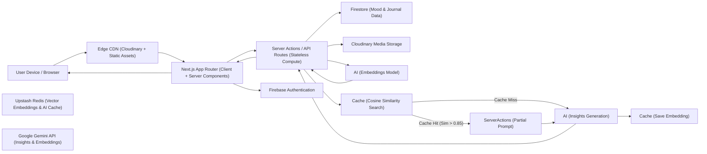

# Moody: Plataforma Escalable de Seguimiento de Estado de Ánimo con IA

[](https://github.com/aditya-2k23/moody)
[](https://github.com/aditya-2k23/moody/blob/main/LICENSE)
[](https://app.netlify.com/projects/moody-adi/deploys)
[](https://github.com/aditya-2k23/moody/discussions)

Pruébalo en vivo en: [https://moody-adi.netlify.app/](https://moody-adi.netlify.app/)

Moody es una aplicación web de seguimiento del estado de ánimo **minimalista** y moderna construida con Next.js, React y Firebase. Diseñada para la simplicidad y facilidad de uso, permite a los usuarios registrar sus estados de ánimo diarios, visualizar su historial y administrar su cuenta de forma segura con autenticación. La aplicación cuenta con una interfaz de usuario hermosa, mejoras de accesibilidad y retroalimentación en tiempo real, todo manteniendo una experiencia limpia y enfocada.

## Table of Contents

- [Características](#-features)
- [Tecnologías](#️-tech-stack)
- [Soporte para Docker](#-docker-support)
- [Cómo Empezar](#-getting-started)
- [Cómo Usarlo](#-how-to-use)
- [CI/CD y Automatización con Docker](#-cicd--docker-automation)
- [Licencia](#-license)
- [Comunidad](#-community)
- [Créditos](#-credits)

## 🚀 Características

- **Seguimiento del Ánimo**: Registra tu estado de ánimo diario con un solo clic y consulta tu historial en un calendario.
- **Autenticación de Usuario**: Regístrate, inicia sesión y cierra sesión de forma segura usando Firebase Authentication.
- **Memorias Visuales**: Sube y lleva un registro de fotos para cada día mediante la integración con Cloudinary, con una cuadrícula hermosa para ver tus recuerdos y un visor de pantalla completa que admite zoom y navegación.
- **Panel de Control**: Panel personalizado que muestra estadísticas de ánimo, ánimo promedio, racha actual y tiempo restante del día.
- **Analíticas Avanzadas**: Sumérgete en tu bienestar emocional con gráficos interactivos impulsados por **Recharts**. Explora tendencias de ánimo, patrones semanales, comparaciones mes a mes, distribución del ánimo y consistencia en el journaling.
- **Insights del Diario con IA**: Obtén análisis instantáneos y personalizados, análisis de ánimo, desencadenantes emocionales y consejos prácticos utilizando **Google Gemini Flash 3 Preview**, respaldado por caché en el servidor con Redis y **Búsqueda de Similitud Semántica** (Embeddings) para consultas repetidas con contexto.
- **Chat con IA de Lumi (Beta)**: Chat en tiempo real con Lumi con ritmo de burbujas, contexto a corto plazo y **Generación Aumentada por Recuperación (RAG)** para memoria a largo plazo, permitiendo a Lumi recordar contextualmente tus entradas anteriores del diario a través de sesiones diarias.
- **Chat de Demo de Lumi (Experiencia de Aterrizaje)**: Los visitantes por primera vez reciben una conversación de bienvenida dedicada con un **límite de demostración de 5 mensajes** y una notificación clara del límite antes de iniciar sesión.
- **Selector de Ánimo para Invitados**: Prueba el registro de ánimo al instante sin registrarte, ¡usando la nueva sección interactiva para invitados!
- **Página de Inicio Hermosa**: Una página de inicio completamente rediseñada con animaciones de desplazamiento dinámicas, una cuadrícula de características y una estética moderna.
- **Eliminación Segura**: Control total sobre tus datos con la capacidad de eliminar memorias específicas (se sincroniza con Firestore y Cloudinary) y un proceso robusto y secuencial de eliminación de cuenta que limpia todos los registros de Redis, Cloudinary y Firebase.

## 🛠️ Tecnologías

- **Next.js** (App Router)
- **React** 19+
- **Firebase** (Autenticación y Firestore)
- **Cloudinary** (Almacenamiento y transformación de imágenes)
- **Google Gemini Models** (Insights de IA + Chat de Lumi)
- **Upstash Redis** (Caché del lado del servidor)
- **lucide-react** (Iconos)
- **Tailwind CSS**
- **react-hot-toast**
- **recharts** (Analíticas Avanzadas)

## 🏗️ Arquitectura



## 🐳 Soporte para Docker

Una imagen de Docker precompilada está disponible para facilitar la configuración y garantizar entornos consistentes. Esto es ideal para colaboradores y pruebas locales rápidas sin necesidad de gestionar versiones locales de Node.js.

### Descargar la imagen

Puedes descargar la imagen precompilada desde Docker Hub o GitHub Container Registry (GHCR):

**Docker Hub:**

```sh
docker pull temaroon/moody:latest
```

**Registro de Contenedores de GitHub (GHCR):**

```sh
docker pull ghcr.io/aditya-2k23/moody:latest
```

### Ejecución local con un solo comando (recomendado para colaboradores)

Si clonaste este repositorio, puedes iniciar Moody con Docker Compose:

```sh
docker compose up --build
```

Esto mapea el puerto `3000:3000` automáticamente e incluye valores predeterminados seguros para que la aplicación pueda arrancar sin pasar variables de entorno manualmente. Si deseas integraciones completas (Firebase Admin, eliminación de Cloudinary, insights de IA, caché de Redis), crea un archivo `.env` a partir de `.env.example` y completa los valores reales.

Nota: los registros del contenedor pueden imprimir una URL como `http://<container-id>:3000`. Ese es el nombre de host interno de Docker. En tu máquina, abre [http://localhost:3000](http://localhost:3000).

### Ejecutar el contenedor

Debes proporcionar las variables de entorno requeridas. Puedes pasarlas individualmente o usar un archivo `.env`.

```sh
docker run -d -p 3000:3000 --name moody --env-file .env temaroon/moody:latest
```

Una vez en ejecución, accede a la aplicación en [http://localhost:3000](http://localhost:3000).

## 📦 Cómo Empezar

Si prefieres Docker, consulta la sección [Soporte para Docker](#-docker-support) anterior.

1. **Clona el repositorio:**

   ```sh
   git clone https://www.github.com/aditya-2k23/moody.git
   cd moody
   ```

2. **Instala las dependencias:**

   ```sh
   npm install
   ```

3. **Configura las variables de entorno:**  
   Copia [`.env.example`](./.env.example) a `.env` y completa tus credenciales.

   ```env
   # Firebase Client
   NEXT_PUBLIC_API_KEY=...
   NEXT_PUBLIC_AUTH_DOMAIN=...
   NEXT_PUBLIC_PROJECT_ID=...
   NEXT_PUBLIC_STORAGE_BUCKET=...
   NEXT_PUBLIC_MESSAGING_SENDER_ID=...
   NEXT_PUBLIC_APP_ID=...

   # Cloudinary
   NEXT_PUBLIC_CLOUDINARY_CLOUD_NAME=...
   NEXT_PUBLIC_CLOUDINARY_UPLOAD_PRESET=...

   # Firebase Admin (v2.0+)
   FIREBASE_SERVICE_ACCOUNT_KEY='{"project_id": "...", ...}'

   # AI Insights + Lumi Chat (v3.0.0 beta)
   GEMINI_API_KEY=...

   # Redis Caching (v3.0.0 beta)
   UPSTASH_REDIS_REST_URL=...
   UPSTASH_REDIS_REST_TOKEN=...

   # Demo session signing (recommended)
   DEMO_SESSION_SECRET=...
   ```

4. **Ejecuta el servidor de desarrollo:**

   ```sh
   npm run dev
   ```

5. **Ejecuta el conjunto de pruebas (opcional):**

   ```sh
   npm test              # run all tests
   npm run test:coverage # run tests with HTML coverage report
   ```

6. **Revisa el código (lint) (opcional):**

   ```sh
   npm run lint
   ```

## 📝 Cómo Usarlo

1. **Registra tu Día**: Ingresa cómo te sientes y escribe una breve entrada en tu diario.
2. **Añade Fotos**: Selecciona hasta 5 fotos para capturar la esencia visual de tu día.
3. **Obtén Insights**: Haz clic en guardar para obtener un análisis de IA de tu ánimo y desencadenantes al instante.
4. **Revive Memorias**: Haz clic en cualquier imagen en tu cuadrícula de memorias para abrir el visor de pantalla completa. Usa las teclas de flecha para navegar por las fotos de tu mes.
5. **Chatea con Lumi (Beta)**: Haz preguntas de seguimiento o simplemente habla sobre tu día en el panel de chat de Lumi.
6. **Gestiona el Historial**: Usa el calendario para saltar entre meses y ver tus tendencias emocionales pasadas.

## 🤖 CI/CD y Automatización con Docker

Moody utiliza un sistema de CI/CD de dos vías:

### GitHub Actions — Construcción y Publicación de Docker

- Se activa en cada push a `main` (se excluyen cambios únicamente en documentación).
- Construye y publica imágenes en **Docker Hub** (`temaroon/moody`) y **GHCR** (`ghcr.io/aditya-2k23/moody`).
- Las imágenes se etiquetan con la versión de `package.json`, el SHA del commit de git y `latest`.

### Jenkins — Verificación de Calidad

Se incluye un `Jenkinsfile` para CI de Jenkins autoalojado. El pipeline ejecuta estas etapas en orden:

| Etapa                    | Comando                        | Propósito                                  |
| ------------------------ | ------------------------------ | ------------------------------------------ |
| Instalar Dependencias    | `npm ci`                       | Instalaciones reproducibles y exactas al lock-file   |
| Auditoría de Seguridad   | `npm audit --audit-level=high` | Falla ante CVEs de alto/crítico nivel              |
| Lint                     | `npm run lint`                 | ESLint con reglas `next/core-web-vitals`   |
| Pruebas Unitarias        | `npm run test:ci`              | 103 pruebas vía Jest + RTL                 |
| Construcción para Producción | `npm run build`                | Verificación completa de compilación `next build`      |

El pipeline requiere la herramienta NodeJS configurada en Jenkins y las variables de entorno `NEXT_PUBLIC_*` agregadas como credenciales de Texto Secreto (los valores de marcador son suficientes para CI).

## 📄 Licencia

Este proyecto está licenciado bajo la **Licencia MIT**. Consulta el archivo [LICENSE](LICENSE) para más detalles.

## 💬 Comunidad

¿Tienes ideas, preguntas o comentarios? ¡Nos encantaría saber de ti!
👉 **[Únete a la Discusión en GitHub](https://github.com/aditya-2k23/moody/discussions)**

## 🫶 Créditos

- Creado con 💜 por [Aditya](https://github.com/aditya-2k23)
- Inspirado en la aplicación de seguimiento de ánimo de [Smoljames](https://www.youtube.com/@Smoljames) [Broodl](https://github.com/jamezmca/broodl/)
- ¡Gracias a la comunidad de código abierto por las bibliotecas y herramientas que hicieron esto posible!
