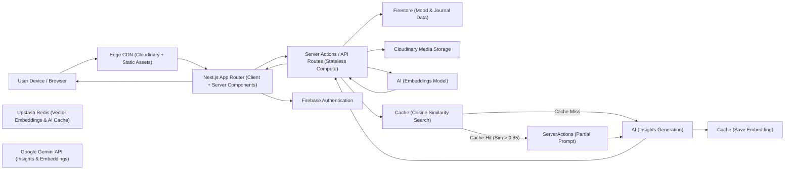

# Moody: Scalable AI Mood Tracking Platform

[](https://github.com/aditya-2k23/moody)
[](https://github.com/aditya-2k23/moody/blob/main/LICENSE)
[](https://app.netlify.com/projects/moody-adi/deploys)
[](https://github.com/aditya-2k23/moody/discussions)

Check it out live at: [https://moody-adi.netlify.app/](https://moody-adi.netlify.app/)

Moody is a **minimalistic** and modern mood-tracking web application built with Next.js, React, and Firebase. Designed for simplicity and ease of use, it allows users to log their daily moods, visualize their mood history, and manage their account securely with authentication. The app features a beautiful UI, accessibility enhancements, and real-time feedback—all while maintaining a clutter-free, focused experience.

## Table of Contents

- [Features](#-features)
- [Tech Stack](#️-tech-stack)
- [Docker Support](#-docker-support)
- [Getting Started](#-getting-started)
- [How to Use](#-how-to-use)
- [CI/CD & Docker Automation](#-cicd--docker-automation)
- [License](#-license)
- [Community](#-community)
- [Credits](#-credits)

## 🚀 Features

- **Mood Tracking**: Log your daily mood with a single click and view your mood history on a calendar.
- **User Authentication**: Sign Up, Log In, and Log Out securely using Firebase Authentication.
- **Visual Memories**: Upload and keep track of photos for each day using Cloudinary integration, with a beautiful grid layout to view your memories with a full-screen viewer supporting zoom and navigation.
- **Dashboard**: Personalized dashboard showing mood stats, average mood, current streak, and time remaining in the day.
- **AI-Powered Journal Insights**: Get instant, personalized insights, mood analysis, emotional triggers, and actionable pro tips using **Google Gemini Flash 3 Preview** — powered by server-side Redis caching and **Semantic Similarity Search** (Embeddings) for context-aware repeat lookups.
- **Lumi AI Chat (Beta)**: Real-time chat with Lumi with chat-bubble pacing, short-term + long-term memory, and daily session history.
- **Lumi Demo Chat (Landing Experience)**: First-time visitors get a dedicated onboarding conversation tone with a **5-message demo cap** and a clear limit toast before sign-in.
- **Guest Mood Selector**: Try out mood logging instantly without signing up, using the new Guest interactive section!
- **Beautiful Landing Page**: A fully redesigned landing page featuring dynamic scroll animations, a features grid, and a modern aesthetic.
- **Secure Deletion**: Full control over your data with the ability to delete specific memories (syncs with Firestore and Cloudinary) and a robust, sequential account deletion process that cleans up all Redis, Cloudinary, and Firebase records.

### 🆕 Editor & Accessibility Overhaul (v3.1.0)

- **📝 Enhanced Markdown Support**: Global integration of `react-markdown` and `@tiptap/react` ensuring that formatting (bolds, italics, lists) is natively rendered across the AI Insights panel, Chat History, and Journal Modals without breaking HTML layouts or swallowing text.
- **♿ Accessibility Boost**: Extensive audit applying ARIA attributes to style tools, Chat containers, standardizing interactive components, and utilizing localized GSAP refs for more resilient, screen-reader-friendly animations.
- **✨ Editor Polish**: The TipTap `RichTextEditor` and `ChatInput` now use advanced whitespace and newline normalization alongside reactive `useRef` states to prevent cursor jumping, state-staleness, and redundant synchronization during human vs voice typing.
- **🛡️ Robust Formatting RegEx**: Replaced brittle string manipulation with `([\s\S]*)` Regex to accurately strip wrapper quotes containing multi-line code blocks and lists returned by AI models.
- **💅 UX/UI Refinement**: Centralized component sizing (`Loader.js`), optimized GSAP transitions (`Splashscreen.js`, `Memories.js`), updated tailwind background opacities (`GlowBackground.js`), and removed unneeded dependencies.

### 🆕 Performance & Security Pass (v3.0.3)

- **🚀 Highly Parallel Deletions**: Account removal is now much faster, utilizing parallelized Cloudinary asset destruction and batched Redis key scanning.
- **🛡️ CI/CD Hardening**: GitHub Action workflows are now pinned to immutable commit SHAs for maximum supply-chain security.
- **🔒 HMAC-Signed Demo Sessions**: Enhanced unauthenticated chat security with signed session cookies and robust Redis quota management.
- **⚡ Next.js 16 Ready**: Fully migrated to asynchronous cookie handling and optimized server-side flows.
- **🩹 Stability Patches**: Fixed various edge cases in focus management, DOM ID collisions, and real-time calendar syncing.

### 🆕 Chatbot Release (v3.0.0)

- **🤖 Lumi Chat Companion**: Added a dedicated conversational flow via `app/api/chat/route.js` and reusable chat UI via `components/chat/ChatContainer.js`.
- **🧠 Better Chat Resilience**: Multi-model Gemini fallback for transient capacity failures, with cleaner user-facing error messaging for quota and high-demand states.
- **💬 Bubble-Aware Responses**: Lumi chat now returns JSON bubble arrays; frontend renders each bubble separately with human-like staggered timing.
- **🕘 Chat History Sessions**: Daily chat history grouped by session with quick restore in the chat modal.
- **🧪 Demo Chat Onboarding Mode**: Demo users now use a dedicated prompt variant tailored for first-time conversation flow, while preserving Lumi's core chat architecture in authenticated dashboard chat.
- **🔒 Demo Quota Reliability**: Demo quota is scoped per session to avoid cross-visitor limit bleed, and the demo cap is currently **5 messages** with a visible toast at limit.
- **✨ Discovery Improvements**: Added a new landing-nav `Lumi` link with new-feature indicator dot for faster feature discoverability.
- **🏷️ Beta Branding Pass**: Updated app branding to reflect `v3.0.0 (beta)` across header, hero, footer, metadata, and chat UI.

## 🛠️ Tech Stack

- **Next.js** (App Router)
- **React** 19+
- **Firebase** (Auth & Firestore)
- **Cloudinary** (Image storage & transformation)
- **Google Gemini Models** (AI Insights + Lumi Chat)
- **Upstash Redis** (Server-side caching)
- **lucide-react** (Icons)
- **Tailwind CSS**
- **react-hot-toast**

## 🏗️ Architecture



## 🐳 Docker Support

A prebuilt Docker image is available for easier setup and consistent environments. This is ideal for contributors and quick local testing without needing to manage local Node.js versions.

### Pull the image

You can pull the prebuilt image from Docker Hub or GitHub Container Registry (GHCR):

**Docker Hub:**

```sh
docker pull temaroon/moody:latest
```

**GitHub Container Registry (GHCR):**

```sh
docker pull ghcr.io/aditya-2k23/moody:latest
```

### One-command local run (recommended for contributors)

If you cloned this repository, you can start Moody with Docker Compose:

```sh
docker compose up --build
```

This maps port `3000:3000` automatically and includes safe defaults so the app can boot without manually passing env vars. If you want full integrations (Firebase Admin, Cloudinary deletion, AI insights, Redis cache), create a `.env` from `.env.example` and fill the real values.

Note: container logs may print a URL like `http://<container-id>:3000`. That is the internal Docker hostname. On your machine, open [http://localhost:3000](http://localhost:3000).

### Run the container

You must provide the required environment variables. You can pass them individually or use an `.env` file.

```sh
docker run -d -p 3000:3000 --name moody --env-file .env temaroon/moody:latest
```

Once running, access the application at [http://localhost:3000](http://localhost:3000).

## 📦 Getting Started

If you prefer Docker, see the [Docker Support](#-docker-support) section above.

1. **Clone the repository:**

   ```sh
   git clone https://www.github.com/aditya-2k23/moody.git
   cd moody
   ```

2. **Install dependencies:**

   ```sh
   npm install
   ```

3. **Set up environment variables:**  
   Copy [`.env.example`](./.env.example) to `.env` and fill in your credentials.

   ```env
   # Firebase Client
   NEXT_PUBLIC_API_KEY=...
   NEXT_PUBLIC_AUTH_DOMAIN=...
   NEXT_PUBLIC_PROJECT_ID=...
   NEXT_PUBLIC_STORAGE_BUCKET=...
   NEXT_PUBLIC_MESSAGING_SENDER_ID=...
   NEXT_PUBLIC_APP_ID=...

   # Cloudinary
   NEXT_PUBLIC_CLOUDINARY_CLOUD_NAME=...
   NEXT_PUBLIC_CLOUDINARY_UPLOAD_PRESET=...

   # Firebase Admin (v2.0+)
   FIREBASE_SERVICE_ACCOUNT_KEY='{"project_id": "...", ...}'

   # AI Insights + Lumi Chat (v3.0.0 beta)
   GEMINI_API_KEY=...

   # Redis Caching (v3.0.0 beta)
   UPSTASH_REDIS_REST_URL=...
   UPSTASH_REDIS_REST_TOKEN=...

   # Demo session signing (recommended)
   DEMO_SESSION_SECRET=...
   ```

4. **Run the development server:**

   ```sh
   npm run dev
   ```

## 📝 How to Use

1. **Log Your Day**: Enter how you're feeling and write a short journal entry.
2. **Add Photos**: Select up to 5 photos to capture the visual essence of your day.
3. **Get Insights**: Hit save to get AI analysis of your mood and triggers instantly.
4. **Relive Memories**: Tap on any image in your memories grid to open the full-screen viewer. Use Arrow keys to navigate through your month's photos.
5. **Chat with Lumi (Beta)**: Ask follow-up questions or simply talk through your day in the Lumi chat panel.
6. **Manage History**: Use the calendar to jump between months and view your past emotional trends.

## 🤖 CI/CD & Docker Automation

Moody uses GitHub Actions to automate the build and push process for Docker images.

- **Automatic Versioning**: The workflow triggers on every push to `main`.
- **Image Tags**: Images are tagged with the version from `package.json` and the git commit SHA.
- **Latest Tag**: The `latest` tag always points to the most recent successful build from the `main` branch.

## 📄 License

This project is licensed under the **MIT License**. See the [LICENSE](LICENSE) file for more details.

## 💬 Community

Have ideas, questions, or feedback? We'd love to hear from you!
👉 **[Join the Discussion on GitHub](https://github.com/aditya-2k23/moody/discussions)**

## 🫶 Credits

- Built with 💜 by [Aditya](https://github.com/aditya-2k23)
- Inspired by [Smoljames](https://www.youtube.com/@Smoljames) mood-tracking app [Broodl](https://github.com/jamezmca/broodl/)
- Thanks to the open-source community for libraries and tools that made this possible!
